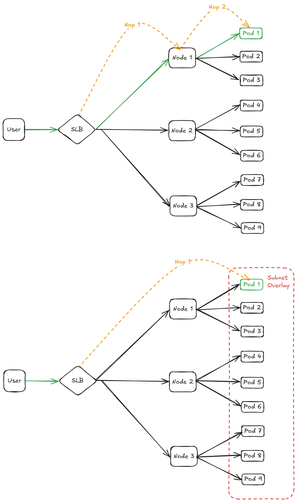

# Container Load Balancer Design Document

## Background

> The following `User` stands for human users, or any cluster provisioning tools (e.g., AKS).

This design document describes the user-facing design and workflow of the Standard V2 LoadBalancer - Container Based Backendpool.

## Comparison to Node Based Load Balancer

- Today, traffic to Services of type LoadBalancer is sent to cluster nodes where it is load balanced again to be either forwarded to the Pod on said Node, or forwarded to another Node where the destination Pod lives.

- In contrast, Pod based backendpool offers a fundamentally improved approach. Traffic destined to a Service of type LoadBalancer reaches the Pod directly, without additional DNAT and without additional hop through another Node. This approach significantly reduces data path (less hops) and control plane (smaller backendpool updates) latencies, as well as removes Service count limitations that are currently present. 
- In this context, the middleware capabilities of the Cloud Provider are utilized to construct and synchronize the relevant Kubernetes resources with the state in Azure Resource Manager.

## Azure Resource Config

1. Current users do not need to take any action, and the ongoing changes will not affect them.

2. New Users must create a Container Based Cluster.

3. Then, they must create a `Standard V2` sku Load Balancer

4. After that, no further action is needed, as all networking resources will be automatically provisioned when new pods, LoadBalancer services, and egresses are created.

## Workflow

### How to use

- Apart from selecting the correct SKU in Azure, no additional steps are required.
- Within the Kubernetes cluster, the pod, service, and all other resource manifests remain unchanged. T
- The actual work occur during the processing of these resources as they are provisioned. The cloud provider monitors updates within the resources and their mappings, processing them accordingly.

### High Level DataPath

- Above is the current datapath of SLB - Node based - Multiple networking hops.

- Bottom is the new proposal of SLB - Container based - Single networking hop.

### Control Plane Batch Processing

1. Introduces DiffTracker API to keep track of the synchronization between the Kubernetes (K8s) cluster and its NRP resources structure.

2. Introduces LocationAndNRPServiceBatchUpdater as a parallel thread worker used as the main engine for DiffTracker synchronization. It runs continuously, waiting for updates in the cluster on a boolean channel and triggering NRP API requests.

3. All updates within the K8s cluster (regarding pods, services, egresses, etc.) are stored within DiffTracker.

4. After each update, a boolean value of `true` is sent through the LocationAndNRPServiceBatchUpdater channel.

5. The LocationAndNRPServiceBatchUpdater run method waits to consume booleans from the channel. When a value is consumed, it uses all the updates stored in DiffTracker to update NRP using the NRP API. Eventually, all successful NRP API calls are stored back into DiffTracker to assert the equivalence of the two structures (K8s cluster and Azure).

6. DiffTracker also functions as a batch operations aggregator. When a cluster undergoes multiple rapid updates, DiffTracker's state will continuously be updated. Meanwhile, the LocationAndNRPServiceBatchUpdater, running on a single thread, will consume updates from the channel. As a result, multiple updates can accumulate and be ready to be sent to the NRP in a single batch.

